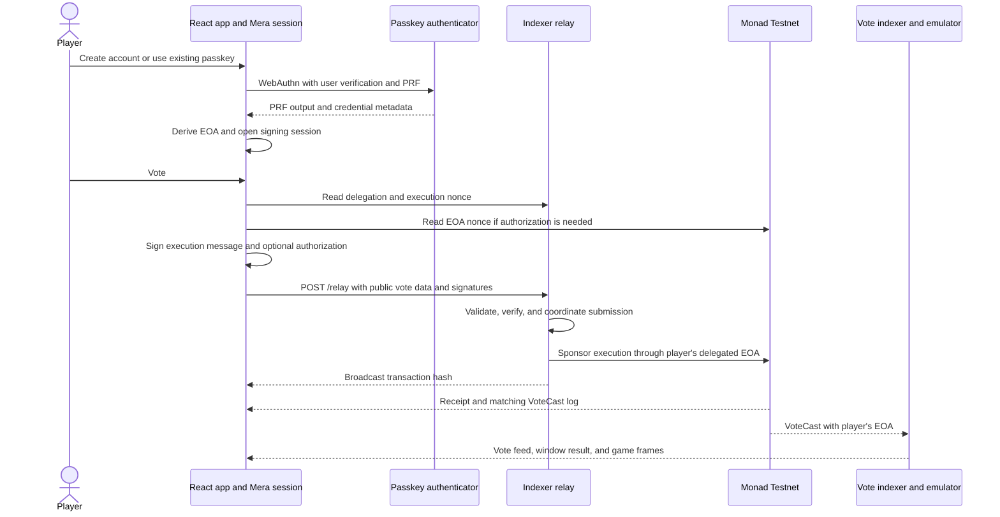

# Mera integration plan

Add Mera passkey login alongside Privy and external wallets, and use the existing EIP-7702 relay to sponsor votes from the Mera account. Mera's viem adapter supplies the signing methods this flow needs. Start with a compatibility check, then implement account recovery and session management, extract the relay client, and connect the new login option to voting.

The agreed scope is an additive integration on Monad Testnet, retaining Privy and external wallet options. The research and design below record the reviewed plan. The implementation status records the evidence collected afterward.

## Implementation status

Implemented on `feat/mera-integration`. Mera `0.2.0`, BIP-32 `2.4.0`, and BIP-39 `2.4.0` are pinned. Node 24 is configured for development and deployment. Nixpacks uses the Node 24 archive identified in its [provider source](https://github.com/railwayapp/nixpacks/blob/main/src/providers/node/mod.rs).

The app supports passkey creation, discovery, unlock, explicit and idle locking, fresh verification for phrase export, and pending-vote lookup while locked. Phrases hide after one minute. Public credential metadata and pending references persist; signing material remains in memory. Mera and Privy share the relay client. Privy uses its `useSign7702Authorization` hook because the installed Privy viem adapter does not implement authorization signing.

The relay verifies execution and authorization signatures, coordinates sponsor and player nonces, persists signed transactions before broadcast, and reconciles receipts against matching vote events. It enforces sponsorship limits, retains pending reservations across restarts, cancels expired submissions when fees permit, and refuses a second journal writer. Existing contracts and the game loop are unchanged.

Local evidence:

- Frontend checks cover fixed derivation, recovery through a mnemonic, signature recovery, ended sessions, stale ceremonies, StrictMode cleanup, idle locking, phrase expiry, lost responses, pending conflicts, and Privy signing calls.
- Anvil checks execute actual Mera-derived signatures through the relay and existing contracts. They cover first and repeat votes from an unfunded account, a winning aggregation window, invalid requests, unsupported account states, concurrency, restart recovery, retained delegation after a revert, sponsorship limits, cancellation, journal write failure, and exclusive journal ownership.
- JPEG generation through `sharp` works under Node 24. Both application builds and the existing contract tests pass. Full frontend lint reports existing errors in the unchanged `GameScreen.tsx`; changed source files pass.

Before public enablement, verify real desktop and mobile passkeys, account recovery across browsers, live Privy and injected wallets, and Monad Testnet execution. Full emulator startup and the receipt-to-emulator input check require a Pokemon Red ROM, which is not available in this workspace. Production RP ID, deployed origin policy, proxy allowlist, sponsor funding, and voting latency still need deployment verification. At the user's request, Mera is now enabled by default and in the example configuration. Sponsored voting still requires relay configuration and funding.

## Research baseline

Reviewed on 2026-10-01:

- This repository at `2f4aaafe0f63a4ae8d5fc0faa2cd7b51fe165a1b`, including the active frontend, relay, contracts, vote aggregation, streaming, and deployment configuration.
- [Mera source](https://github.com/category-labs/mera/tree/a3102f4fa7b89ce4e58e843a2d6da2201035ff25) at `a3102f4fa7b89ce4e58e843a2d6da2201035ff25`, including its documentation, passkey implementation, signing sessions, viem adapter, and web demo.
- The published `@category-labs/mera@0.2.0` package, downloaded for inspection without installing it into this repo or executing its scripts. Its `passkey.ts` and `viem.ts` match the reviewed source. Package metadata differs from the repository manifest: the published package declares Node `>=24` and different cryptography dependency versions. Use the published artifact and lockfile as the implementation baseline. [Published metadata](https://registry.npmjs.org/@category-labs/mera/0.2.0).

Mera is in preview. Pin the initial version exactly and review updates before changing it. [Upstream status](https://github.com/category-labs/mera/blob/a3102f4fa7b89ce4e58e843a2d6da2201035ff25/README.md).

## Repository baseline before implementation

| Area | Current implementation | Integration consequence |
| --- | --- | --- |
| App providers | [`frontend/src/main.tsx`](../frontend/src/main.tsx) wraps the app in Privy, SmartWalletsProvider, React Query, and Privy's wagmi provider. | Mera needs its own session owner. It has no requirement to become a Privy wallet. |
| Login and identity | [`App.tsx`](../frontend/src/App.tsx) derives `privy`, `direct`, or `relay` mode from Privy and wagmi state. Login, button availability, displayed address, and vote highlighting depend on those modes. | Add an explicit Mera mode. Existing effects must not overwrite a user's Mera selection. |
| Vote submission | [`VoteButtons.tsx`](../frontend/src/components/VoteButtons.tsx) contains Privy smart wallet submission, external wallet submission, and the relay signing and HTTP flow. | Extract the reusable relay operations before adding another signer. |
| Relay API | [`indexer/src/index.ts`](../indexer/src/index.ts) exposes `/relay`, `/relay/delegated/:address`, `/relay/nonce/:address`, and `/relay/health` when enabled. It pays gas from a backend wallet. | Reuse the API and gas sponsor. Strengthen request validation and transaction outcome handling. |
| Delegated execution | [`SimpleDelegation.sol`](../contracts/src/SimpleDelegation.sol) verifies an EIP-191 signature, consumes a nonce in the delegated EOA's storage, and calls the vote contract. | A Mera EOA can use the same signature format and contract, subject to the compatibility check. |
| Voting and game loop | [`MonadPlaysPokemon.sol`](../contracts/src/MonadPlaysPokemon.sol) emits `VoteCast(msg.sender, action)`. The indexer aggregates those events and runs the authoritative emulator. | The expected player is the Mera EOA. Existing event ingestion and game execution can consume its votes. |
| Build and deployment | [`nixpacks.toml`](../nixpacks.toml) selects Node 20 and builds both applications. | Adopt Node 24 for the published Mera package and verify the existing indexer dependencies under that runtime. |

The active frontend uses `config/wagmi.ts`. `hooks/useWallet.ts` and `utils/contract.ts` are a separate, currently unused wallet path; do the integration in the active path. `CLAUDE.md` also describes an older client emulator design, while the source runs the emulator in the indexer.

Several existing relay details need attention before expanding sponsored access:

- The handler validates some request fields but does not recover the vote signer or authorization signer before spending relay gas. Contract verification occurs during execution.
- `/relay` returns after broadcast and reports `delegated: true`. The client immediately caches delegation and increments its execution nonce. A transaction hash does not establish either result.
- The shared relay wallet submits concurrent requests without explicit nonce coordination. The frontend cooldown applies within one component instance and cannot coordinate tabs or players.
- `isDelegated()` converts RPC failures to `false`, and `/relay/nonce` returns zero for every address reported as undelegated. Those results cannot distinguish a fresh account from an RPC outage, another delegation, or a previously used account whose delegation was cleared.
- `RELAY_MAX_GAS_PRICE` and the backend signature validity setting are parsed in `config.ts` but are not enforced by the handler.
- The external wallet authorization fallback uses a message-signing method where EIP-7702 requires an authorization signature. Mera's `signAuthorization` provides the correct primitive; this fallback is not a template for the new path.

## Mera APIs and account model

Use these published entry points:

| API | Role in this app |
| --- | --- |
| `createPasskeyWithPrfOutput` from `@category-labs/mera` | Explicitly create a new discoverable passkey and obtain its PRF output. |
| `getPasskeyPrfOutput` from `@category-labs/mera` | Unlock a known credential or select an existing passkey on another browser or device. |
| `createSecp256k1SigningSession` from `@category-labs/mera` | Hold the derived EVM signing key for an active play session. |
| `toViemAccount` from `@category-labs/mera/viem` | Adapt the session to a viem account with `signMessage` and `signAuthorization`. |
| `session.end()` | End signing and zero the session's owned key buffer. |

The adapter implements EIP-191 message signing and EIP-7702 authorization signing. Signing through an active session does not invoke WebAuthn again. [Adapter source](https://github.com/category-labs/mera/blob/a3102f4fa7b89ce4e58e843a2d6da2201035ff25/library/src/viem.ts).

Mera leaves account derivation to the application. Follow its documented EVM recipe: PRF output as BIP-39 entropy, English mnemonic, BIP-39 seed with an empty passphrase, then BIP-32 path `m/44'/60'/0'/0/0`. Declare `@scure/bip32` and `@scure/bip39` as direct dependencies. Use Mera's stable default PRF salt, `sha256("mera.prf.salt.v1")`, for creation, sign-in, and export. [Derivation recipe](https://github.com/category-labs/mera/blob/a3102f4fa7b89ce4e58e843a2d6da2201035ff25/docs/src/content/docs/recipes/create-passkey-accounts.mdx), [salt contract](https://github.com/category-labs/mera/blob/a3102f4fa7b89ce4e58e843a2d6da2201035ff25/library/src/passkey.ts).

Treat that derivation, salt, and production relying party ID as persistent account settings. Changing them can change or prevent recovery of the account. Record a derivation version in public metadata, and keep the original derivation supported if later versions are introduced. Local storage is a hint: validate its schema and resolve RP ID, salt, and derivation through the application's supported configuration, rather than accepting arbitrary stored parameters.

Each new passkey produces a separate account. Existing Privy EOAs, Privy smart wallets, and external wallets retain their existing identities. Creating a Mera account does not transfer their address, history, or assets. Adding a second independent passkey would also create a different account under this scheme; shared-account recovery through multiple credentials would require a separate design.

## Proposed flow



### Login, recovery, and session lifetime

Provide separate **Create passkey account** and **Use existing passkey** actions. Creation can require a second authenticator prompt when PRF evaluation is unavailable during creation. If the second step fails, a passkey may already exist; offer sign-in or retry guidance without automatically creating another credential. [Passkey creation behavior](https://github.com/category-labs/mera/blob/a3102f4fa7b89ce4e58e843a2d6da2201035ff25/library/src/passkey.ts).

Store only public metadata locally: schema and derivation versions, RP ID, credential ID, optional transport hints, and derived address. On reload, show a locked identity. An explicit unlock reproduces the account and checks that it matches the cached address before voting becomes available. Treat malformed or missing storage as recoverable, and offer discovery without a credential restriction so clearing site data does not force account creation. An explicit account switch can select a different passkey.

Own the session in a hook with a ref and expose narrow operations such as create, unlock, lock, and submit vote. Keep the PRF output, seed, private key, and signing session out of persisted state, logs, and telemetry. After session creation, clear caller-owned byte buffers and wipe the derivation objects using the selected BIP-32 library's cleanup API. Cleanup must also run after partial failures.

Proposed session policy: lock on logout, account switch, page exit, component disposal, and after 15 minutes without player interaction. Check expiry again before signing, because background timers can be delayed. Reload always starts locked. Allow only one passkey ceremony at a time, and discard late results after logout or account changes, ending any newly created session. React StrictMode must not initiate ceremonies or leave an abandoned session alive.

Include recovery phrase export behind a fresh verification of the selected passkey. Re-derive the phrase for that action, verify the resulting address, and clear the display when dismissed or locked. Recovery through a synced passkey depends on the user's authenticator provider. The mnemonic is a JavaScript string and cannot be reliably zeroed; keep it transient. The upstream demo has a useful reference flow. [Recovery example](https://github.com/category-labs/mera/blob/a3102f4fa7b89ce4e58e843a2d6da2201035ff25/demos/web/src/connect.ts).

Define the exported phrase's recovery path: import it into a compatible external EVM wallet using the documented derivation path and empty passphrase, verify the address, then use this app's existing external-wallet connection. That path requires MON for direct voting. Test this with a disposable account before describing export as working recovery. The phrase restores the EOA key; it does not recreate the original passkey. Creating another passkey would produce a new identity. [Upstream derivation and portability](https://github.com/category-labs/mera/blob/a3102f4fa7b89ce4e58e843a2d6da2201035ff25/docs/src/content/docs/concepts/entropy-keys-and-accounts.mdx).

Use HTTPS in deployment and `localhost` for development. Configure an explicit, stable production `VITE_MERA_RP_ID` before enrolling real users. Prefer the exact app hostname to reduce exposure from sibling subdomains. Preview environments and localhost use separate credentials. Preserve the production hostname and recovery path during any future hosting migration.

### Vote signing and nonce handling

Retain the execution digest that `SimpleDelegation.execute()` verifies:

```text
keccak256(encodePacked(
  owner, voteContract, uint256(0), voteCalldata,
  executionNonce, deadline, chainId
))
```

Sign it with `account.signMessage({ message: { raw: messageHash } })`. The raw byte form matters: signing the hexadecimal text as a string produces a different EIP-191 digest.

For a fresh account, read its current EOA transaction nonce and call the Mera account's `signAuthorization` with the configured delegation address, chain ID, and that nonce. The relay is the transaction sender, so use the authority's nonce without a self-execution increment. Map the result to the relay's existing authorization fields: `chainId`, `nonce`, `r`, `s`, and `yParity`. Keep the delegation address pinned on both sides. Serialize JSON integers deliberately and reject values outside the supported safe range.

Represent delegation state as fresh, expected delegation, unsupported account state, or lookup failure. Limit combined delegation-and-vote to an account with empty code and transaction nonce zero. Read execution state from accounts already delegated to the expected implementation. For empty-code accounts with a nonzero transaction nonce, stop automatic delegation and offer account recovery guidance. Clearing an EIP-7702 delegation clears code without resetting the account's storage; assuming execution nonce zero can therefore fail after re-delegation. Supporting that case requires a separate state recovery design. RPC errors must return an unavailable state without prompting for authorization. [EIP-7702 code clearing and storage](https://eips.ethereum.org/EIPS/eip-7702#storage-management).

Keep three nonce sources distinct:

| Nonce | Owner and source | When it advances |
| --- | --- | --- |
| Authorization nonce | Mera EOA transaction count from the chain | When the authorization is applied, or the EOA sends a transaction. |
| Execution nonce | `getNonce(owner)` called on the delegated EOA | When a signed delegated execution succeeds. Read zero for a fresh EOA. |
| Relay transaction nonce | Backend relay wallet transaction count | As the sponsor submits transactions for all players. |

Use one outstanding Mera vote per account until its outcome is reconciled for the first release. Show submitted feedback when broadcast succeeds, then reconcile the receipt and the matching `VoteCast` log before using the next execution nonce. Keep this conservative policy until measurements justify pipelining. The existing cooldown remains a UI control, while the backend coordinates requests across tabs and players.

Treat broadcast, receipt success, delegation installation, and the vote event as separate observations. EIP-7702 applies authorizations before execution, and delegation can remain installed after the execution reverts. An invalid authorization can also be skipped. Re-read both delegation and execution state after failures; do not infer them from a transaction hash or receipt status alone. [EIP-7702 behavior](https://eips.ethereum.org/EIPS/eip-7702#behavior).

A timeout leaves the outcome unknown. Reconcile an existing transaction or signed request before offering a retry. Do not automatically sign the same action with a fresh nonce while an earlier submission may still execute. A locked session stops future signing; it does not cancel signatures already issued or transactions already broadcast.

### Request identity and recovery after interruption

Make timeout recovery implementable even when the client never receives a transaction hash:

- Use the execution message hash as `requestId`. Add `executionNonce` as a decimal string to the updated relay request. The relay recomputes the ID from the configured target, chain, action, owner, nonce, and deadline and verifies the signature. Alternative signature encodings or authorization retries for the same execution must retain the same ID.
- Before POST, persist a public pending reference containing the request ID, account, chain, vote contract, action, execution nonce, and deadline. Add the transaction hash when known. Keep these references across reload, logout, and account switches; no private keys, vote signatures, or authorizations belong in browser storage.
- Expose `GET /relay/requests/:requestId` with submission state and any known transaction hash. Status responses exclude signed transaction bytes. Check an existing validated request record before rejecting a repeated request because its execution nonce has already been consumed.
- Persist the request record, sponsor nonce, signed transaction bytes, and computed transaction hash on the relay's persistent volume before broadcasting. On restart, reconcile unresolved records and resume the same transaction where valid. This closes the gap between broadcasting and saving the hash. Keep unresolved records until their outcome is known; a polling timeout is not an eviction condition.
- If no record exists, the client must not assume the request failed. Retry the identical request while its signature is valid, or wait for expiry and reconcile account state. After a reload has discarded the signature, recover status before inviting a new vote. Any re-signing of an unresolved request uses the original digest and parameters, never a fresh execution nonce.

Use a small journal under the configured `SAVE_DIR` on the existing Railway volume, with serialized, atomic, durable writes and restricted file access. Journal submission state and sponsorship reservations together. If persistence is unavailable, stop accepting sponsored requests. Enforce a single relay writer during normal operation and deployment handover; the current startup delay does not establish exclusive ownership. Persistent records enable recovery, but do not guarantee that a submitted transaction will be included.

### Relay changes

Extend the existing request shape and apply validation to every caller. The relay remains responsible for choosing the vote target, zero value, and calldata from the validated action. Add `nonceDecimal` alongside the current numeric nonce response during migration; updated clients use the string to avoid truncating the contract's integer nonce.

1. Validate addresses, integer actions, signature encodings, authorization fields, and deadlines. Enforce the server's maximum signature lifetime and configured chain and delegation address.
2. Recover the execution signer and check the submitted execution nonce against the delegated EOA's state for a new request. For first use, verify the authorization signer, chain, target, and current authority nonce before spending gas. Reject an unexpected existing delegation or an unsupported account state instead of silently replacing code or assuming a zero nonce.
3. Serialize sponsor nonce allocation and broadcast. Keep one pending execution per player, recognize repeat requests by their validated ID, and return the known status. Hold that player's reservation until reconciliation finishes. Bound the queue and prune resolved records after their signatures expire; retain unresolved records across restarts.
4. Add per-address and per-IP limits plus a global sponsorship budget and queue bound. Reserve the maximum transaction cost before acceptance, persist the reservation, and settle it against actual receipt costs. Address limits alone cannot constrain users creating many accounts. Configure trusted proxy handling for Railway before relying on client IPs.
5. Enforce the existing gas price limit and low-balance behavior. Check first-vote and subsequent-vote gas requirements against actual execution rather than treating comments and fixed limits as measurements.
6. Return transaction submission status accurately. Let the Mera client reconcile through its configured public RPC. Extend health information with chain ID and readiness so the frontend can detect mismatched contracts, disabled sponsorship, or an unavailable relay.

Update the existing Privy relay client with the new request/status protocol in the same release. Its current optimistic nonce cache must not conflict with the backend's pending-request reservation. Return structured pending, stale-nonce, and authorization-required responses and handle each explicitly. A pending conflict includes the existing request ID so a client can recover status even after losing local metadata. Give old browser bundles an actionable refresh error when their requests cannot be handled safely. Privy smart-wallet submission and direct external-wallet submission retain their separate transports.

Waiting for receipt reconciliation changes the relay voting cadence from today's broadcast-based cooldown. Measure that effect for Mera and Privy relay users before public enablement, and document the accepted cadence. Preserve immediate submitted feedback, and do not present the old latency comments as measurements of the revised flow.

### Frontend integration

Add a distinct `mera` auth mode and use the Mera address consistently in the header, copy control, and `VoteChat` highlighting. Its readiness must depend on its own session and relay availability. It must not depend on wagmi reporting a connected account or on Privy authentication finishing.

Keep a single active voting identity. Switching from Mera locks its session and clears cached delegation and nonce assumptions, while retaining public pending-request references for reconciliation. Guard the current Privy auto-connect and auth-mode effects so a background provider update cannot change the selected signer. Share the auth-mode type between `App` and `VoteButtons`.

Start with Mera voting through sponsorship. If the relay is disabled, unhealthy, or configured for a different chain or contract, explain that voting is temporarily unavailable and keep account recovery accessible. Avoid silently submitting a transaction that charges the user. A funded Mera account's direct transaction path can be a later extension.

Map Mera's `PRF_UNAVAILABLE`, `PASSKEY_OPERATION_FAILED`, `CRYPTO_UNAVAILABLE`, and `SESSION_ENDED` errors to useful UI states. Support cannot be inferred from the presence of `PublicKeyCredential` alone. Keep existing login options available when the selected authenticator cannot produce PRF output. [Authenticator requirements](https://github.com/category-labs/mera/blob/a3102f4fa7b89ce4e58e843a2d6da2201035ff25/docs/src/content/docs/authenticator-support.md).

## Implementation sequence

| Step | Work and likely files | Completion evidence |
| --- | --- | --- |
| 1. Confirm compatibility | Pin Mera `0.2.0`; select and pin BIP-32 and BIP-39 packages in `frontend/package.json` and its lockfile. Move `nixpacks.toml` and documented development setup to Node 24. Reuse the existing viem dependency first; its declared range meets Mera's peer requirement, but compile and runtime compatibility still need checking. | Production frontend build and indexer build succeed. A Mera signature recovers to the expected EOA, and its authorization works through a local EIP-7702 execution followed by a Monad Testnet smoke check. Verify indexer startup and `sharp` frame generation under Node 24. |
| 2. Implement the account lifecycle | Add `frontend/src/utils/mera.ts` for fixed derivation, credential metadata, session construction, and recovery export. Add `frontend/src/hooks/useMeraWallet.ts` for UI state and lifecycle ownership. | Create, unlock, lock, reload, and discovery after clearing storage reproduce the expected address. Cancellation and stale async results leave no usable abandoned signer. |
| 3. Make relay submission reusable | Add `frontend/src/utils/relay.ts`; move digest construction, request encoding, delegation lookup, and status reconciliation out of `VoteButtons.tsx`. Persist public pending references and update both Mera and Privy relay clients to the request/status protocol. Accept narrow signer callbacks. | EIP-191 payload bytes match the contract. Mera signs authorization through its viem adapter. Both clients recover status after a lost POST response and handle pending-request conflicts. |
| 4. Make sponsorship reliable | Extract relay routes into `indexer/src/relay.ts` and isolate the durable request journal in `indexer/src/relayStore.ts`. Update `indexer/src/index.ts` and `config.ts` for validation, nonce coordination, limits, health, startup recovery, and persistent storage under `SAVE_DIR`. | Invalid signatures and authorizations fail before broadcast. Concurrent players use distinct sponsor nonces. Interruptions before and after broadcast, repeat requests, deployment handover, and exhausted budgets have explicit outcomes. |
| 5. Wire the player experience | Update `App.tsx`, `VoteButtons.tsx`, and relevant styles. Add passkey create/sign-in, lock/unlock, backup, address selection, and error states. Keep session ownership in the app hook; introduce a provider only if actual consumers require it. | The chosen Mera identity remains active through provider updates. Votes appear as that player's address and trigger the ordinary game loop. Existing wallet modes still work. |
| 6. Configure and document deployment | Add `VITE_MERA_ENABLED`, `VITE_MERA_RP_ID`, and `VITE_MERA_RP_NAME` to `frontend/.env.example`; document session policy and relay limits. Update `README.md`, `indexer/.env.example`, and stale architecture guidance in `CLAUDE.md`. | The stable deployment origin can create and recover an account, frontend and backend agree on network and contracts, and disabling enrollment preserves recovery access. |

Agree the request/status fields and errors before splitting client and server work in steps 3 and 4. Deploy the protocol changes together. Public enablement depends on all six steps.

Use `config/wagmi.ts` as the existing integration point for network and contract settings. Make its HTTP transport and the Mera public client honor `VITE_RPC_URL`; it currently hardcodes the RPC despite the documented environment variable. Verify backend `HTTP_RPC_URL` and `RPC_URL` target the same configured network.

No contract ABI change is expected for this approach. A failed compatibility check or a defect found in delegated execution would require revisiting that assumption before rollout. Keep the work focused on accounts and vote submission; game aggregation, save format, and frame transport are outside this integration's change scope.

## Trust boundaries and risks

Mera returns PRF bytes to the page and keeps software signing keys in memory. The authenticator protects the passkey credential, while application scripts can access returned secrets or a reachable live signer. Zeroing buffers limits exposure but does not guarantee that all copies leave process memory. Treat dependencies and every script on the unlock origin as trusted code. [Mera security model](https://github.com/category-labs/mera/blob/a3102f4fa7b89ce4e58e843a2d6da2201035ff25/docs/src/content/docs/concepts/security-model.mdx).

| Boundary or risk | Required treatment |
| --- | --- |
| Authenticator to browser | Require PRF and user verification. Passkey operations stay on the configured RP domain. |
| Browser memory to storage and telemetry | Persist public metadata only. Review error reporting and debug logs for secret-bearing values; never send PRF output, keys, or recovery phrases to the relay. |
| Other scripts on the app origin | Review loaded scripts and dependencies, remove unnecessary access, and check the deployed content security policy against required Privy, RPC, and streaming connections. A Mera session grants full EOA signing authority. |
| Public relay endpoint to sponsor wallet | Verify signatures and target restrictions, constrain spending, and coordinate pending transactions. CORS alone does not authorize sponsorship. |
| Broadcast response to game result | Reconcile receipt, delegation, and matching vote event independently. Only indexed chain events enter the game loop. |
| RP domain and credential availability | Commit to a stable hostname and provide export. Local metadata loss is recoverable through discovery; loss of every passkey copy and export is not. |
| Existing and newly derived identities | Label account creation clearly. Never imply that a new passkey recovers an existing Privy or external wallet address. |

`SimpleDelegation` can execute arbitrary owner-signed calls even though this relay only constructs votes. Ending a Mera session does not revoke the on-chain delegation. Document that distinction in account help and future account migration work.

## Validation and acceptance criteria

These are acceptance checks for implementation and rollout. The implementation status above distinguishes local evidence from remaining deployment checks.

1. **Account recovery:** A fixed PRF input produces a stable expected address. A real credential reproduces its address after logout, reload, local metadata deletion, and sign-in from a compatible environment with access to the same passkey. A different passkey is treated as a different account. Import an exported phrase into a compatible external wallet, verify the same address, and exercise direct voting with a funded test account.
2. **Lifecycle:** Locked, expired, replaced, and disposed sessions cannot sign. Late login results and React StrictMode cleanup cannot revive a logged-out account. Export requires fresh verification of the intended credential.
3. **Signature compatibility:** Execute-message signatures recover correctly from raw hash bytes. Authorization signatures recover to the same EOA with the exact configured chain, delegation target, and authority nonce. Wrong action, signer, chain, target, nonce, or deadline is rejected.
4. **First and repeat votes:** The first sponsored transaction installs the intended delegation and emits `VoteCast` from the Mera EOA. A subsequent vote uses the execution nonce from that EOA's storage and does not require another passkey prompt while unlocked.
5. **Failure outcomes:** Cover an expired signature, skipped or invalid authorization, reverted execution with delegation retained, RPC lookup failure, cleared or unexpected delegation, dropped or replaced transaction, and relay restart. Interrupt the server after journaling and after broadcast; drop the HTTP response and reload the browser. Request lookup must recover the recorded outcome without a second execution. Receipt success without the expected event is not reported as a completed vote.
6. **Concurrency and spending:** Rapid clicks, two tabs with the same account, concurrent different accounts, duplicate requests, deployment handover, rate limits, fee caps, and sponsor exhaustion behave predictably. A signature with a different encoding for the same execution maps to the same request. Neither new account creation nor a process restart resets the global spending allowance or loses pending reservations.
7. **Browser behavior:** Use automated fixtures for deterministic derivation and lifecycle checks, then actual PRF-capable authenticators for create and sign-in. Include desktop and mobile combinations from upstream's support matrix, cancellation, an unsupported authenticator, HTTPS deployment, and localhost. Simulated credentials alone do not establish provider compatibility.
8. **Product regression:** Privy sponsorship, existing relay use, external-wallet voting, address highlighting, spectator mode, vote aggregation, emulator input, game saves, and frame streaming still work. Measure the interval from click to broadcast and from broadcast to indexed vote before considering nonce pipelining.

At the research baseline, the repo had Foundry tests for the voting contract, with no frontend or indexer test script or dedicated `SimpleDelegation` test. The implementation adds frontend unit checks and an Anvil integration suite covering the signing boundary, delegation behavior, and relay request handling. Confirm that local behavior on Monad Testnet before rollout. Run the frontend lint/build, indexer build, and contract suite; record pre-existing failures separately.

The decisive integration check follows a real passkey-derived signature through relay acceptance, chain execution, and the matching indexed vote. Use a controlled voting window with a known winning action to check the resulting emulator input. During shared play, an individual player's vote may lose the tally. The proposed-state feed and the receipt check are separate observations; the feed alone does not prove finalized execution. A signing unit test alone cannot establish the complete flow.

## Rollout and remaining deployment decisions

Start with the feature disabled, complete the compatibility and failure checks, and enable it on a stable staging origin. Verify a zero-balance Mera EOA can vote through sponsorship. Before public enablement, confirm the production RP ID, browser coverage, sponsor funding, and operational limits.

Define `VITE_MERA_ENABLED` to control new passkey enrollment and Mera vote submission while keeping existing account unlock and export reachable. Vite reads this flag at build time, so changing it requires a frontend rebuild. A frontend rollback cannot remove passkeys from authenticators or clear on-chain delegation. Keep the original RP domain and derivation implementation available for recovery.

This frontend flag controls the UI and cannot stop direct HTTP requests to the sponsor. Use server-side relay enablement and spending limits for an operational stop, while leaving request-status lookup available for pending transactions. That stop affects every sponsored client. A caller-supplied wallet-mode label is not reliable evidence that a request came from Mera.

The plan uses the following defaults until product or deployment requirements change them:

| Decision | Proposed default | Who must supply the final value |
| --- | --- | --- |
| Production RP ID | Exact stable application hostname. | Deployment owner before enrollment. |
| Session lifetime | Lock after 15 minutes of inactivity, plus explicit lock and lifecycle cleanup. | Maintainer if play sessions need another policy. |
| Mera voting without sponsorship | Keep voting unavailable and retain unlock/export access. | Maintainer if a funded direct path is wanted. |
| Sponsorship limits | Per-address and per-IP throttles, bounded queue, and global spending cap. | Operator, using available funding and measured transaction costs. |
